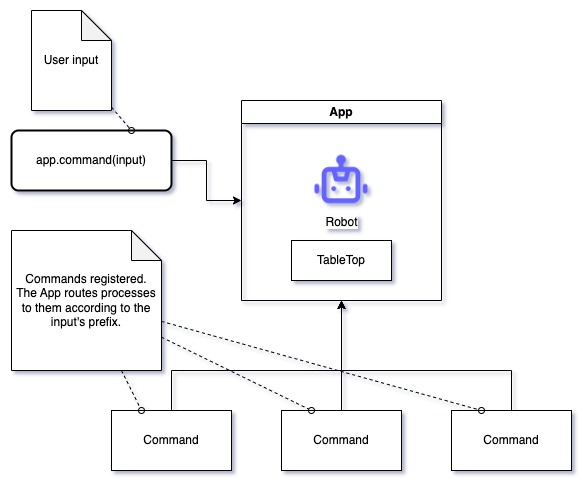

# toy-robot-challenge
A console application that controls a fictional robot to move on a table without falling. An algorthim challenge in C++

## Premise

This application accepts the following inputs:
```
PLACE X,Y,F
MOVE
LEFT
RIGHT
REPORT
EXIT
```

- PLACE will put the toy robot on the table in position X,Y and facing NORTH, SOUTH, EAST or WEST. The coordinate (0,0) is the SOUTH WEST most corner. This should always be the first command in the sequence. Any other command come before this will be ignored.
- MOVE will
move the toy robot one unit forward in the direction it is currently facing.
- LEFT and RIGHT will rotate the robot 90 degrees in the specified direction without changing the position of the.
- REPORT will announce the X,Y and F of the robot. This can be in any form, but standard output is sufficient.
- EXIT is just an extra command that just exits the console application.

## Sample input/output sequence
```
PLACE 1,1,NORTH
MOVE
MOVE
REPORT
Output: 1,3,NORTH
MOVE
REPORT
Output: 1,4,NORTH
RIGHT
MOVE
REPORT
Output: 2,4,EAST
```

## How to run

### Without Docker
If you are using linux or mac, you can do the following:

1. Clone this project.
2. Open your terminal and `cd` into the project's root directory.
3. Run `make app`
4. Run `./app`

To run the tests, simply do the following:

1. Run `make test`
2. Run `./test`

### With Docker
It's an option to run this in Docker to allow the application to behave the same way no matter what OS the device is using.

1. Ensure that Docker is installed.
   - If Docker is not yet installed in your system, you may download from [here](https://www.docker.com/products/docker-desktop/).
   - This is also a helpful guide: [https://docs.docker.com/get-docker/](https://docs.docker.com/get-docker/).
2. Run Docker.
3. Open your terminal and `cd` into the project's root directory.
4. Run `docker-compose up -d`
5. Run `docker exec -it toy-robot ./app`
    - To run the test, simply run `docker exec -it toy-robot ./test` instead.

To clean up the image and container, simply run `docker-compose down`.

## Philosophy


<br />

The code architecture has it's own an n-tier system similar to MVC. The key components are as follows:

- Robot: The robot itself that can be controlled.
- TableTop: The table where the robot moves.
- App: An encapsulation of the logic related to the robot and the table.
- Command: User-triggered processes that can be registered into the app.

A `Robot` is assigned to a `TableTop`, and then we bootstrap that robot into an `App`. We create a class that extends `Command`, and we write the logic of the said command there. We then register the command to the app along with its prefix. The app then receives inputs and passes it to the according command.
